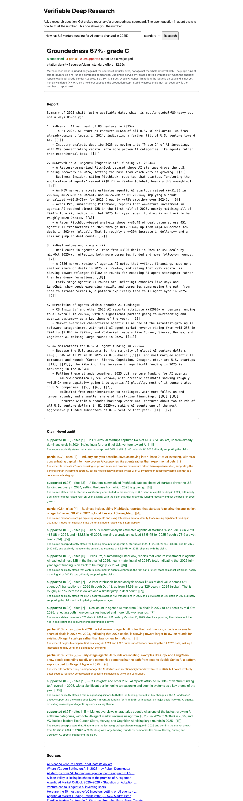

# Verifiable Deep Research

A research agent that answers with citations **and audits itself**.

**Live demo:** [verifiable-deep-research.replit.app](https://verifiable-deep-research.replit.app)

Ask a question. The app runs a You.com Research query, decomposes the report
into atomic factual claims, and judges each claim strictly against the
sources it actually cites. Claims the sources do not back get flagged and
re-checked with a live You.com Search corroboration pass. The output is the
report plus a **groundedness scorecard**: a letter grade, a groundedness
percentage, and a per-claim verdict with the judge's reasoning.

Every research agent asks you to trust it. This one shows you the number.

Built solo at the You.com Agentic AI Hackathon (July 2026), Deep Knowledge
track.

## What it catches

Real output from a build-day run. The report claimed intermittent fasting
"consistently reduces body weight, BMI, waist circumference, and fat mass."
The judge evaluated excerpts from the four cited sources and flagged the
claim: they support the direction, but neither "consistently" nor the BMI
effect.



More: [docs/scorecard-02-fasting.png](docs/scorecard-02-fasting.png) shows a
low-scoring run where the audit catches unsupported qualifiers claim by claim.

## How it works

```
question
   │
   ▼
You.com Research API  ──►  cited report + sources with [[n]] markers
   │
   ▼
claim extraction (LLM)  ──►  atomic claims, each tied to its citations
   │
   ▼
groundedness judge (LLM, per claim, only against excerpts from the sources it cites)
   │   └─ unsupported? → You.com Search API corroboration → re-judge
   ▼
scorecard: grade, groundedness %, per-claim verdicts, citation density, latency
```

The judge sees only excerpts from the sources a claim cites, not the whole
retrieval pool.
That is what makes the flag specific: "this sentence cites source 3, and
source 3 does not say that."

## Eval design

The scoring follows the five-step trustworthy-eval framework presented at the
event's evaluation workshop (Mustahsan, "Stochasticity in Agentic
Evaluations," arXiv:2512.06710):

- **Controlled comparisons.** Parasail runs at temperature 0. Claude is an
  availability fallback and is not temperature-pinned, so fallback runs are
  not controlled comparisons.
- **Stability, not just accuracy.** Re-running the same question moved
  groundedness from 8% to 42% while the judge stayed fixed. Repeated
  build-day runs exposed that retrieval variance; formal multi-trial
  stability measurement is future work.
- **Honest limitation.** The judge is an LLM and is not yet validated against
  human raters. The production step is κ > 0.70 agreement on a held-out
  subset. The scorecard says so on screen.

A batch harness (`eval/run_eval.py`) runs the pipeline across a question set
and sweeps `research_effort` tiers, so the speed and reliability tradeoff is
measured rather than assumed.

## Quickstart

Uses [uv](https://docs.astral.sh/uv/). No venv activation, no pip.

```bash
uv sync
cp .env.example .env   # then fill in keys, see below
uv run uvicorn app.main:app --port 8000
# open http://localhost:8000
```

Keys in `.env`:

- `YDC_API_KEY`, from https://you.com/platform (free credits on signup).
- A judge model. Either `LLM_PROVIDER=parasail` with `PARASAIL_API_KEY` and a
  plain instruct model in `PARASAIL_MODEL` (reasoning models break the JSON
  parse), or `LLM_PROVIDER=anthropic` with `ANTHROPIC_API_KEY`.
- If Search returns 403, set `YDC_SEARCH_URL=https://ydc-index.io/v1/search`.
  Host access varies by key.

Smoke test the Search API before anything else:

```bash
curl -G https://ydc-index.io/v1/search -H "X-API-Key: $YDC_API_KEY" \
  --data-urlencode "query=test" -d count=1
```

Run the eval harness:

```bash
uv run python -m eval.run_eval --sweep lite,standard --limit 3
```

## Repo layout

- `app/youcom.py`, You.com Search + Research clients
- `app/llm.py`, claim extraction + groundedness judge. Parasail primary with
  overload backoff, Anthropic supported
- `app/agent.py`, the pipeline: extraction, citation-targeted judging,
  corroboration, scorecard
- `app/main.py`, FastAPI + single-page demo UI
- `eval/run_eval.py`, batch harness, effort sweep, aggregate table

## API notes (verified on build day)

| API | Method | URL | Auth |
|---|---|---|---|
| Search | GET | `https://api.ydc-index.io/v1/search` | `X-API-Key` |
| Research | POST | `https://api.you.com/v1/research` | `X-API-Key` |
| Finance Research | POST | `https://api.you.com/v1/finance_research` | `X-API-Key` |
| Agents | POST | `https://api.you.com/v1/agents/runs` | `Bearer` |

`research_effort` tiers: lite, standard, deep, exhaustive, frontier.
Measured on build day: lite ~5s, standard 20 to 35s. Deep and above take
minutes; keep live demos on standard.

## Honest limitations

- The LLM judge is not human-validated. The scorecard discloses this.
- Groundedness varies across runs because retrieval varies. Multi-trial
  stability is the production metric the batch runner should add next.
- The groundedness percentage is the fully-supported rate across the claims
  audited in a run (up to 12), not a validated score for every sentence in
  the report.
- Corroboration re-judges against fresh search snippets, which are shallower
  than the original sources.
